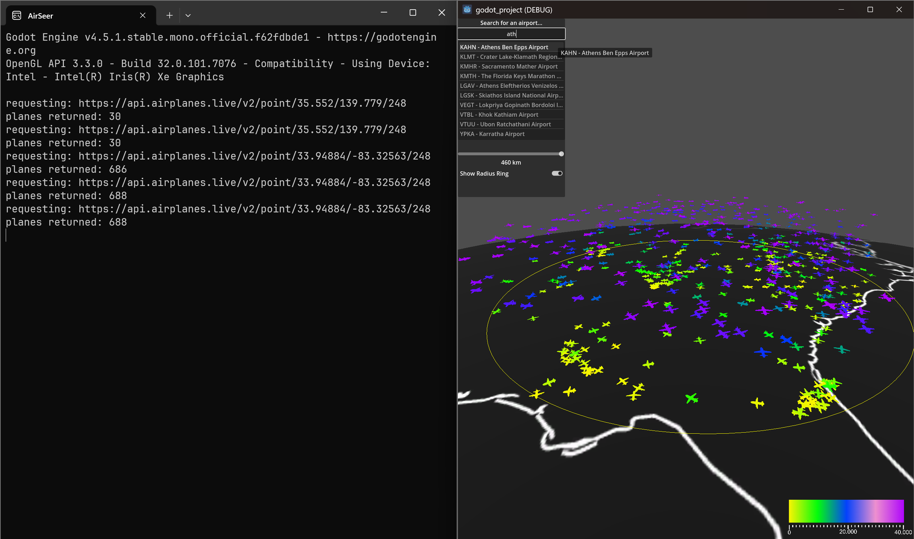

# ✈️ AirSeer — Real-Time 3D Flight Visualizer

> A Godot 4 visualization project for the **VIS WS2025** course.  
> Displays live global air traffic on an interactive 3D globe, fetching real-world aircraft positions from the [airplanes.live](https://airplanes.live) public API.



---

## Features

- 🌍 **Interactive 3D Globe** — Textured Earth sphere with high-resolution country border map (exported from QGIS)
- 📡 **Live Aircraft Data** — Polls the `airplanes.live` API every 10 seconds to fetch real-time aircraft positions within a configurable radius
- 🎨 **Altitude Color Coding** — Each aircraft and its trail are colored by altitude: yellow → green → blue → purple (low → high)
- 🛣️ **Flight Trails** — Per-aircraft position history rendered as smooth 3D ribbon trails on the globe surface
- 🔍 **Airport Search** — Search by ICAO code or airport name from a built-in database; click to instantly jump the view to that airport
- 📏 **Adjustable Radius** — Slider to control the query radius (10–463 km), with an optional visual radius ring overlay
- 🖱️ **Intuitive Camera** — Mouse-drag to rotate, scroll-wheel to zoom, Ctrl+drag to orbit around a pivot point

---

## Screenshots

| Live traffic near Atlanta, GA (688 aircraft) |
|---|
|  |

---

## Project Structure

```
VIS_WS2025_PROJECT/
├── godot-project/              # Godot 4.5 C# application
│   ├── scenes/
│   │   ├── main.tscn           # Main scene (globe, camera, UI, fleet manager)
│   │   └── plane.tscn          # Individual aircraft scene
│   ├── scripts/
│   │   ├── FleetManager.cs     # API polling, aircraft lifecycle management
│   │   ├── PlaneController.cs  # Per-aircraft movement, trail rendering, color
│   │   ├── CameraOrbit.cs      # Globe camera controls
│   │   ├── UIController.cs     # Airport search panel and radius controls
│   │   └── GeoUtils.cs         # Geo-coordinate → 3D position conversion
│   ├── assets/
│   │   ├── earth/              # Globe texture (QGIS export)
│   │   └── aircraft/           # 3D plane model (GLB/OBJ)
│   └── data/
│       └── airports_filtered_utf-8.txt  # Airport database for search
├── qgis-projects/              # QGIS project + exported earth textures
├── screenshots/                # Development screenshots
└── project_prep.docx/.pdf      # Project proposal / documentation
```

---

## Architecture

```
main.tscn
├── CanvasLayer (UI)
│   └── PanelContainer → UIController.cs
│       ├── Airport search (LineEdit + ItemList)
│       ├── Radius slider
│       └── Radius ring toggle
├── earth (MeshInstance3D — sphere with border map texture)
│   └── StaticBody3D + CollisionShape3D (for camera raycasting)
├── CameraPivot → CameraOrbit.cs
│   ├── Camera3D
│   └── DirectionalLight3D
└── FleetManager → FleetManager.cs
    ├── HTTPRequest (airplanes.live API)
    ├── Timer (polling interval)
    └── [dynamic] Plane instances → PlaneController.cs
```

### Data Flow

1. `FleetManager` fires an HTTP request to `api.airplanes.live/v2/point/{lat}/{lon}/{radiusNm}` on a timer
2. The JSON response is parsed; each aircraft entry (`hex`, `lat`, `lon`, `alt_baro`, `track`) is processed
3. New aircraft are **spawned** as `plane.tscn` instances; existing ones are **updated**; departed ones are **freed**
4. `PlaneController` smoothly lerps each plane to its new position using `GeoUtils.LatLonToVector3()` and updates its trail and color

---

## Controls

| Input | Action |
|---|---|
| **Left mouse drag** | Rotate globe |
| **Scroll wheel** | Zoom in / out |
| **Ctrl + left drag** | Orbit camera around a pivot point |
| **Ctrl + R** | Reset camera to center |
| **Search bar** | Type ICAO code or airport name → click result to jump |
| **Radius slider** | Adjust query radius (10–463 km) |
| **Show Radius Ring** | Toggle the yellow radius indicator ring |

---

## Download

Pre-built executables are available on the [Releases](../../releases) page — no Godot installation required.

1. Download the latest `.zip` for your platform from the Releases page
2. Extract the archive
3. Run the executable inside — an internet connection is required for live data

> **Note:** The default view center is set to **Tokyo Narita (35.55°N, 139.78°E)**. Use the airport search to jump to any location.

---

## Building from Source

### Prerequisites

- [Godot Engine 4.5](https://godotengine.org/) with **.NET / C#** support
- .NET SDK 6.0 or later

### Steps

1. Clone the repository:
   ```bash
   git clone https://github.com/ceviert/VIS_WS2025_PROJECT
   cd VIS_WS2025_PROJECT
   ```
2. Open **Godot 4.5 (C#)** and import `godot-project/project.godot`
3. Press **F5** (or click the Play button) to run

---

## API

Aircraft data is sourced from the free, public **[airplanes.live](https://airplanes.live)** API — no API key required.

```
GET https://api.airplanes.live/v2/point/{lat}/{lon}/{radiusNm}
```

Relevant fields used from each aircraft record:

| Field | Description |
|---|---|
| `hex` | ICAO 24-bit address (unique aircraft ID) |
| `lat` / `lon` | Current position |
| `alt_baro` / `alt_geom` | Altitude in feet |
| `track` | Heading in degrees (0–360) |

---

## Map Preparation (QGIS)

The globe texture was created in **QGIS** using the `earth_countries_border_map.qgz` project. Multiple export iterations at varying resolutions (up to 16K) are stored in `qgis-projects/` to balance visual quality and runtime performance.

---

## Course

**VIS WS2025** — Visual Data Analysis, Winter Semester 2025  
University of Applied Sciences, Worms
